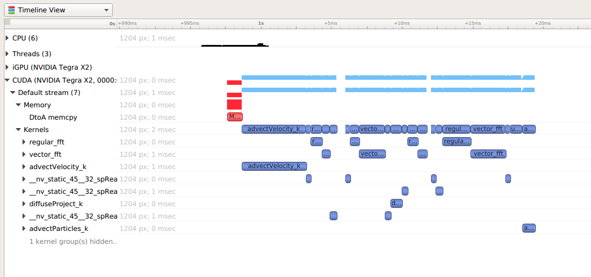

# 性能分析简介

假设你接到了一个任务，要求优化一个具有数万行代码的项目，你会如何着手？直接啃源码肯定不现实，工作量太大，而且很难找到方向。本文的读者应该都对著名的**阿姆达尔定律（Amdahl's Law）**有所了解，它告诉我们：优化一个程序的性能，最有效的方法是优化它的瓶颈，即耗时最多的部分：

$$
\text{Speedup} = \frac{1}{(1 - \text{time}_{\text{optimized}}) + \frac{\text{time}_{\text{optimized}}}{\text{speedup}_{\text{optimized}}}}
$$

这时性能分析就派上用场了。**性能分析（performance profile）**是指对程序运行时的性能进行监控、分析和评估的过程。性能分析的目的是找出程序的性能瓶颈，以便指导优化工作。

## 获取信息

让我们首先了解一下性能分析工具能为我们提供哪些信息。我们将在[性能分析工具](tools.md)中介绍各种各样的性能分析工具，但它们生成的报告内容和形式都大同小异。了解下列几种常见性能分析报告的形式，你也就了解了各种性能分析工具的本质。

### 火焰图

<figure markdown="span">
    
    <figcaption>
        火焰图示例
        <br><small>
        来源：<a href="https://github.com/brendangregg/FlameGraph">brendangregg/FlameGraph: Stack trace visualizer</a>
        </small>
    </figcaption>
</figure>

火焰图将程序的函数调用关系以火焰的形式展现出来，火焰的宽度表示函数的**执行时间**，火焰的高度表示函数的**调用深度**。在火焰图中，处于顶层且占据宽度较大的**“平顶”函数往往是优化的重点对象**。

### 时间线

<figure markdown="span">

<figcaption>
时间线示例
<br><small>
来源：<a href="https://docs.nvidia.com/nsight-systems/UserGuide/index.html#cuda-trace">User Guide — nsight-systems 2025.1 documentation</a>
</small>
</figcaption>
</figure>

时间线对于具有多个执行单元的**并行程序**（如 MPI、OpenMP 和 CUDA 等）有着重要的意义。时间线清晰地展示了程序在不同执行单元上的执行情况，让我们能够对并行程序的几个重要的问题进行分析：

- 执行单元间的工作分配是否均匀
- 执行单元间的通信、同步方式及其效率如何

编写并行程序时，一般要解决上述问题，才能真正发挥并行计算的优势。

## 性能分析原理

!!! quote "参考资料"

    - [Performance Characterization using AMDuProfPcm • uProf User Guide 5.0 • Reader • AMD Technical Information Portal](https://docs.amd.com/r/en-US/57368-uProf-user-guide/Performance-Characterization-using-AMDuProfPcm)
    - [Intel® Performance Counter Monitor - A Better Way to Measure CPU Utilization](https://www.intel.com/content/www/us/en/developer/articles/tool/performance-counter-monitor.html)

作为使用者，大部分情况下我们不需要了解性能分析工具的具体实现原理，只需要了解它们的使用方法即可。本节内容作为扩展，面向对体系结构具有一定了解的读者。

### 性能计数器

不论是 CPU、GPU 还是 NPU，都会在硬件层面设置一些**性能计数器（Performance Counter）**，用于记录各种性能指标。性能分析工具通过读取（采样）这些性能计数器的值，综合分析得到程序的性能数据。

!!! example "以 AMD 为例"

    在 AMD 文档中，性能计数器称为 Performance Monitoring Counter（PMC），分为以下几类：

    - **Core PMC**：每个核心具有一组 PMC，记录该核心内发生的事件，例如指令发射、分支预测情况等。
    - **Uncore PMC**：
        - **L3 PMC**：记录 L3 缓存的事件。
        - **Data Fabric PMC**：记录 CPU Socket、PCIe、DMA 等事件。

以 x86 架构为例，最著名的性能计数器当数**时间戳计数器（TSC，Time Stamp Counter）**。TSC 记录 CPU 时钟周期数，用于计算程序的运行时间，在各种性能分析场景中广泛使用。读取 TSC 的指令是 `rdtsc`，可以通过内联汇编调用：

```c
uint64_t rdtsc() {
    uint32_t lo, hi;
    __asm__ __volatile__ ("rdtsc" : "=a" (lo), "=d" (hi));
    return ((uint64_t)hi << 32) | lo;
}
```

使用该函数就能得到最精确的时间测量结果。

下面这些工具提供了访问硬件性能计数器的接口：

- AMDuProfPcm
- [Intel PCM](https://github.com/intel/pcm)

这些工具我们很少用到，因为其生成的数据太原始太底层。以 `AMDuProfPcm` 为例，它直接将原始数据报告为 CSV 格式：

```csv
Utilization (%),System time (%),User time (%),System instructions (%),User instructions (%),Eff Freq (MHz),IPC (Sys + User),IPC (Sys),IPC (User),CPI (Sys + User),CPI (Sys),CPI (User),Giga Instructions Per Sec,Locked Instructions (pti),Retired Branches (pti),Retired Branches Mispredicted (pti),
0.99,73.00,0.00,100.00,0.00,1760.53,0.40,0.40,0.00,2.47,2.47,0.00,0.01,0.00,217.33,33.59,
1.40,78.43,0.00,100.00,0.00,1481.83,0.53,0.53,0.00,1.88,1.88,0.00,0.01,0.00,240.49,61.99,
0.90,66.07,0.00,100.00,0.00,1482.27,0.30,0.30,0.00,3.37,3.37,0.00,0.00,0.00,249.08,57.19,
0.92,66.94,0.00,100.00,0.00,1481.43,0.27,0.27,0.00,3.64,3.64,0.00,0.00,0.00,252.13,55.27,
```

硬件厂商除了开发特定的工具，也会尝试在操作系统层面提供更友好的访问方式。以 Linux 为例，它们属于 PMU（Performance Monitor Unit）。你可以在 [Performance monitor support — The Linux Kernel documentation](https://docs.kernel.org/admin-guide/perf/index.html) 看到 Linux 内核中各种架构性能检测单元的支持。

### 采样

大部分性能分析工具以采样的方式工作。**程序中运行时间越长的部分，被采样得到的概率越大。**采样大体可以分为两种：

- **定时采样**：每隔一段时间，中断程序的执行，记录当前程序的状态。
- **事件采样**：在程序中插入采样点。当程序执行到采样点时，工具会记录当前程序的状态。

采样的信息包括指令地址、进程和线程 ID、调用栈等。通过分析这些采样信息，性能分析工具生成火焰图、时间线等报告。
