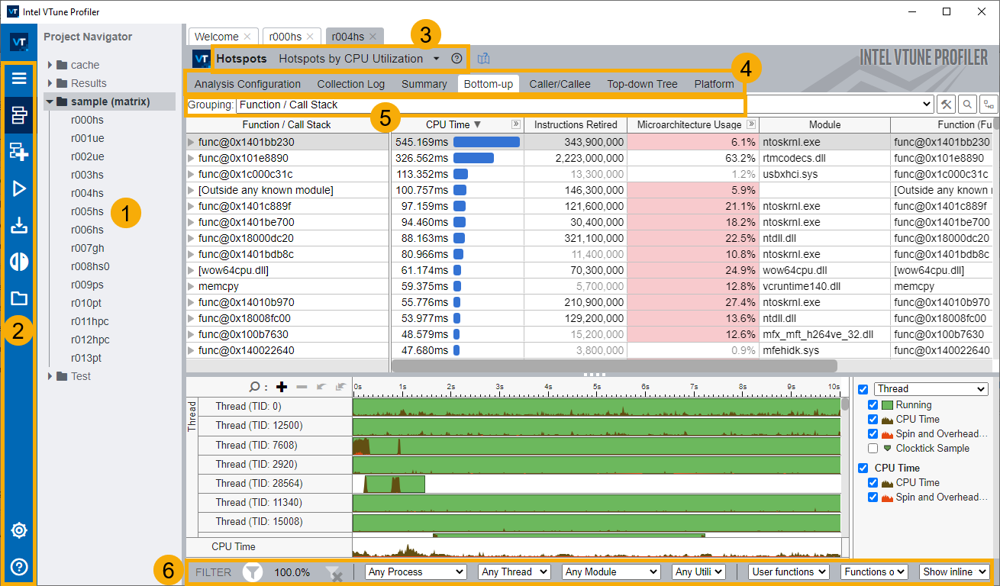
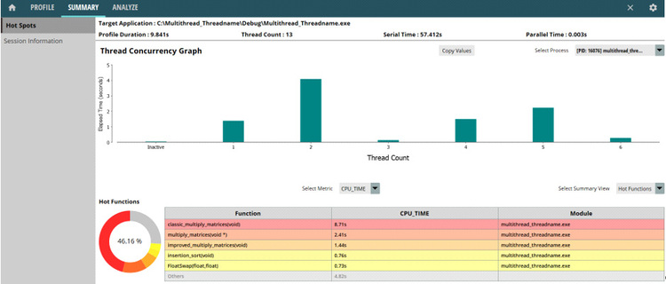
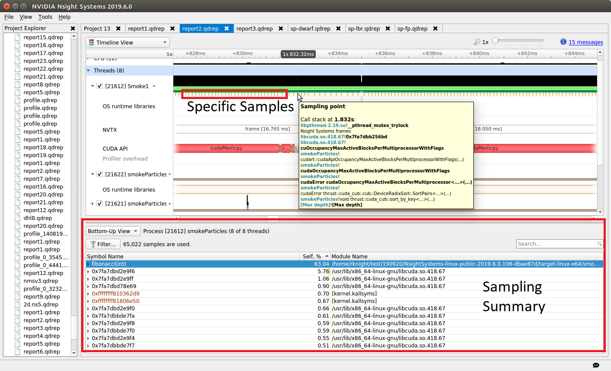
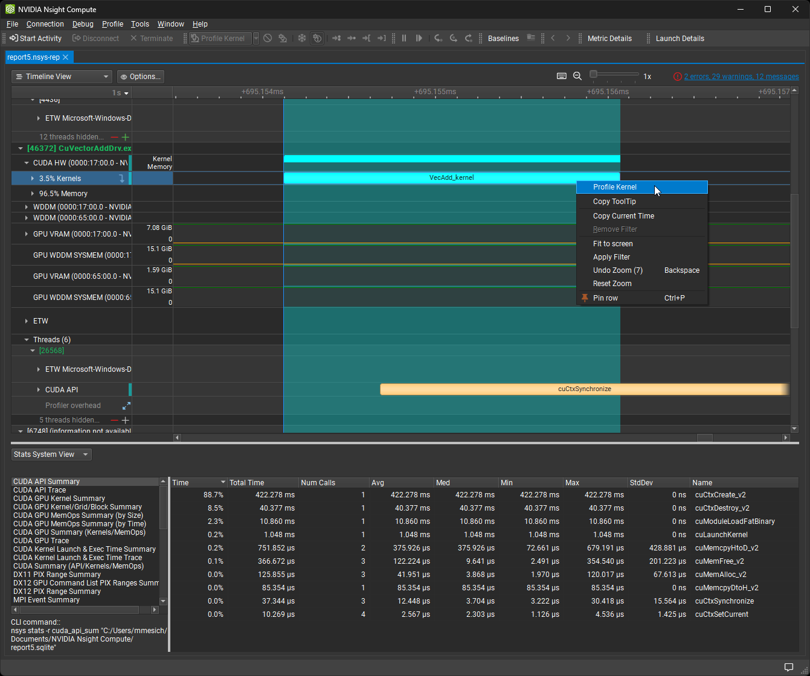
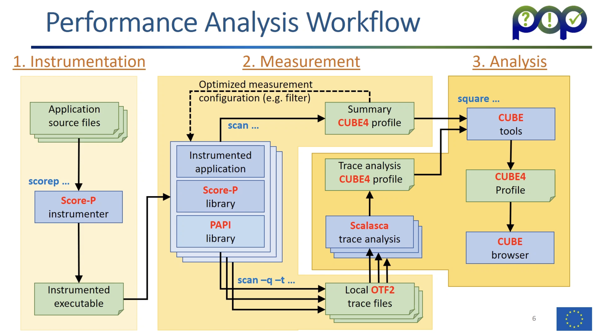

# 性能分析工具

本文简单介绍了一些常用的性能分析工具，并给出**最基本的介绍和结果展示**。这些工具都有自己的手册，我们提供了对应的参考链接，你可以根据自己的需求查阅详细的使用方法。

## Linux

### perf

!!! quote "参考资料"

    - [perf: Linux profiling with performance counters](https://perfwiki.github.io/main/)
    - [Wiki - Linux 效能分析工具：Perf](https://wiki.csie.ncku.edu.tw/embedded/perf-tutorial)

`perf` 是 Linux Kernel 内建的系统能效分析工具。它与内核紧密结合，能够利用内核的 PMU 对性能数据进行采样。

```bash
$ perf stat -B dd if=/dev/zero of=/dev/null count=1000000

1000000+0 records in
1000000+0 records out
512000000 bytes (512 MB) copied, 0.956217 s, 535 MB/s

 Performance counter stats for 'dd if=/dev/zero of=/dev/null count=1000000':

            5,099 cache-misses             #      0.005 M/sec (scaled from 66.58%)
          235,384 cache-references         #      0.246 M/sec (scaled from 66.56%)
        9,281,660 branch-misses            #      3.858 %     (scaled from 33.50%)
      240,609,766 branches                 #    251.559 M/sec (scaled from 33.66%)
    1,403,561,257 instructions             #      0.679 IPC   (scaled from 50.23%)
    2,066,201,729 cycles                   #   2160.227 M/sec (scaled from 66.67%)
              217 page-faults              #      0.000 M/sec
                3 CPU-migrations           #      0.000 M/sec
               83 context-switches         #      0.000 M/sec
       956.474238 task-clock-msecs         #      0.999 CPUs

       0.957617512  seconds time elapsed

$ perf report --sort=dso

# Events: 1K cycles
#
# Overhead                   Shared Object
# ........  ..............................
#
    38.08%  [kernel.kallsyms]
    28.23%  libxul.so
     3.97%  libglib-2.0.so.0.2800.6
     3.72%  libc-2.13.so
     3.46%  libpthread-2.13.so
     2.13%  firefox-bin
     1.51%  libdrm_intel.so.1.0.0
     1.38%  dbus-daemon
     1.36%  [drm]
     [...]
```

## Intel 平台：[VTune](https://www.intel.com/content/www/us/en/developer/tools/oneapi/vtune-profiler.html)

!!! warning "停止支持的工具"

    在部分老旧的文档中，你可能会见到下面的工具和命令：

    - `amplex-cl` Intel® VTune™ Amplifier XE
    - `itac` Intel® Trace Analyzer and Collector

    它们都已停止支持，不再推荐使用。

!!! quote "参考资料"

    - [vtune-profiler-cheat-sheet.pdf](https://www.intel.com/content/dam/develop/external/us/en/documents/vtune-profiler-cheat-sheet.pdf)

VTune 是 Intel 提供的一款性能分析工具，支持 Windows 和 Linux 系统。

```bash
vtune -collect hotspots -r result -- ./a.out
vtune -report summary -r result
```

上面的两行命令分别执行了数据收集和数据处理，其中 `-collect` 选项指定了收集的数据类型，`-r` 选项指定了结果保存的文件夹，`--` 后面是要运行的程序及其参数。参考资料中的 Cheet Sheet 对 VTune 的使用做了精炼的总结，非常值得一看。

完成命令行收集后，就可以在有图形化界面的环境下使用 VTune Profiler 打开查看可视化结果。



## AMD 平台：[μProf](https://www.amd.com/en/developer/uprof.html)

!!! quote "参考资料"

    - [AMD uProf User Guide](https://docs.amd.com/go/en-US/57368-uProf-user-guide)

μProf 是 AMD 提供的一款性能分析工具，支持 Windows 和 Linux 系统。它提供两个 Profiler：

- AMDuProf、AMDuProfCLI：图形界面和命令行界面，使用方法和界面都与 VTune 类似。
- AMDuProfPcm：不常用，偏硬件底层，收集的指标如 IPC、内存带宽、CPU 发射槽等，输出原始 CSV 数据。可以绘制 roofline 测浮点数性能瓶颈。

```bash
AMDuProfCLI collect --config hotspots -o <output-dir> <application>
AMDuProfCLI report -i <session directory>
```



## NVIDIA 平台：[Nsight](https://developer.nvidia.com/nsight-developer-tools)

!!! quote "参考资料"

    - [Nsight Systems Documentation](https://docs.nvidia.com/nsight-systems/)
    - [Nsight Compute Documentation](https://docs.nvidia.com/nsight-compute/)

| 工具名称 | 命令行 | 主要功能 |
|---|---|---|
| [Nsight Systems](https://developer.nvidia.com/nsight-systems) | `nsys` | CPU 和 GPU，系统级性能分析工具 |
| [Nsight Compute](https://developer.nvidia.com/nsight-compute) | `ncu` | CUDA，提供详细性能指标和 API 调试功能 |

!!! tip "Nsight 是为数不多的持续支持使用 macOS 客户端进行远程调试和分析的性能工具。"

```bash
# Nsight Systems
nsys profile ./a.out
# Nsight Compute
ncu -o profile ./a.out
```




## [POP](https://pop-coe.eu/)

!!! quote "参考资料"

    - [:simple-youtube: POP Training](https://www.youtube.com/playlist?list=PLDPdSvR_5-GgOV7MDtvP2pzL29RRrMUqn)

Performance Optimisation and Productivity（POP）是欧洲的一个 HPC 项目，开发了一系列性能监测和优化工具。该项目通过组合多个工具，提供了一个完整的性能分析工作流：

- Score-P：编译、注入
- Scalasa：运行、跟踪
- Cube：分析、可视化

<figure markdown="span">
  
  <figcaption>
    POP 工作流
    <br><small>
  </figcaption>
</figure>

具体的安装、配置、使用可以观看参考链接中的视频，介绍得非常详细。
